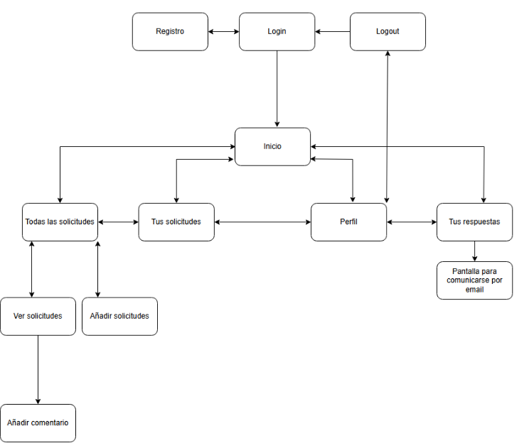
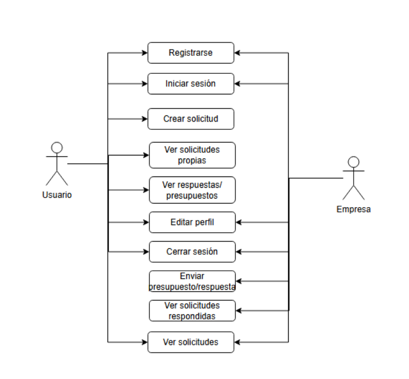
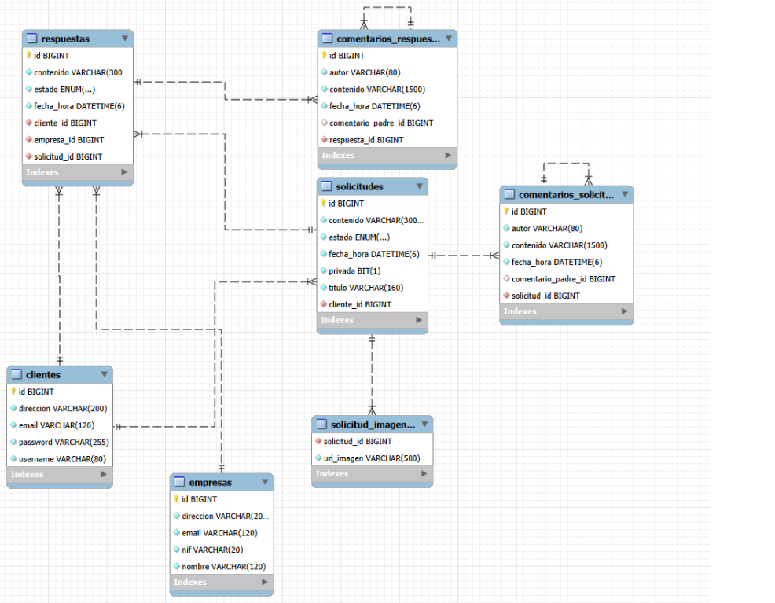

# Proyecto Intermodular: Requestructure

**Autor:** Pablo Morillas Esteve

**Web desplegada:** [https://proyecto-intermodular-five.vercel.app/](https://proyecto-intermodular-five.vercel.app/)

## Tecnologias

- **Web:** React 19 + Vite
- **API:** Spring Boot + Gradle + MySQL
- **Movil:** Android nativo + Kotlin + Jetpack Compose

## Como ejecutar el proyecto

### 1. API (requestructure-api)

Requisitos: Java 21.

```bash
cd requestructure-api
./gradlew bootRun
```

La API se levanta en `http://localhost:8080`.

**Variables de entorno obligatorias:**
- `DB_URL` — URL de conexion JDBC (por defecto apunta a `54.152.73.116:3306`)
- `DB_USER` / `DB_PASSWORD` — credenciales de la base de datos MySQL

**Despliegue real:**
Copia `requestructure-api/.env.example` a `.env` y rellena los valores reales. Spring Boot cargara las variables automaticamente.

### 2. Web

Requisitos: Node.js 18+

```bash
cd Web
npm install
npm run dev
```

Se abre en `http://localhost:5173` y consume la API en `http://localhost:8080`.

### 3. Movil

Abrir la carpeta `Movil/` en Android Studio y ejecutar sobre un emulador o dispositivo fisico.

## Endpoints principales de la API

| Recurso | Endpoints |
|---------|-----------|
| Clientes | `GET /clientes`, `POST /clientes`, `POST /clientes/login`, `PUT /clientes/{id}`, `DELETE /clientes/{id}` |
| Empresas | `GET /empresas`, `POST /empresas`, `PUT /empresas/{id}`, `DELETE /empresas/{id}` |
| Solicitudes | `GET /solicitudes`, `GET /solicitudes/publicas`, `POST /solicitudes`, `PUT /solicitudes/{id}`, `DELETE /solicitudes/{id}` |
| Respuestas | `GET /respuestas`, `POST /respuestas`, `PATCH /respuestas/{id}/estado`, `DELETE /respuestas/{id}` |
| Comentarios | `POST /solicitudes/{id}/comentarios`, `POST /respuestas/{id}/comentarios` |

## Diagramas del proyecto

### Arbol de navegacion


### Casos de uso


### Diagrama EER


## Indice

1. [Planteamiento del problema y justificacion](Docs/planteamiento.md)
2. [Definir objetivos claros](Docs/objetivos.md)
   - Objetivo general
   - Objetivos especificos
   - Objetivo adicional
3. [Planificar un cronograma](Docs/cronograma.md)
4. [Resumen del proyecto](Docs/resumen.md)
   - Espanol
   - English
5. [Gestor de tareas y GitHub](Docs/herramientas.md)
6. [Funcionalidades de la aplicacion](Docs/funcionalidades.md)
   - Requisitos funcionales
   - Requisitos no funcionales principales
7. [Realizar un Estudio del Arte](Docs/estudioDelArte.md)
   - Herramientas similares
   - Puntos fuertes y debiles
   - Comparacion con la propuesta de proyecto
8. [Justificacion de viabilidad](Docs/viabilidad.md)
   - Viabilidad tecnica
   - Viabilidad economica
   - Viabilidad operativa
9. [Diseno](Docs/diseno.md)
   - Inventario de contenidos
   - Arbol de navegacion
   - Realizacion de Wireframe y Mockup
10. [Design System](Docs/designSystem.md)
    - Seleccion de Iconos
    - Tipografia: Inter
    - Uso Estrategico del Color
11. [Justificacion del diseno](Docs/justificacionDiseno.md)
    - Principios basicos de usabilidad
    - Estandares de accesibilidad
12. [Casos de uso y Diagrama EER](Docs/casosDeUso.md)

## Links importantes

- [Link Figma (wireframe y mockup)](https://www.figma.com/design/ShRtCeY3jBAlHW1LGBuoWJ/Style-Guidelines--Community-?node-id=526-4&t=AaGCoo0VvoErjyUy-1)
- [Link Trello](https://trello.com/invite/b/625c99ca95a2977a26e22466/ATTI62f5347fe5f0bca8ac60ac225b9d8e2b69E7581A/proyecto-intermodular)
- [Link Diagrama de Gantt](https://gvaedu-my.sharepoint.com/:x:/r/personal/pabmorest_alu_edu_gva_es/Documents/Diagrama%20de%20Gantt.xlsx?d=w6ad33215e40f4f389e1560307e1e2fdd&csf=1&web=1&e=xtDSaw)

## Estructura de la documentacion

```text
Docs/
|-- imagenes/                 # Carpeta con todas las imagenes del proyecto
|   |-- diseno_arbolNavegacion.png
|   |-- casosDeUso.png
|   `-- diagramaEER.png
|-- planteamiento.md          # Planteamiento del problema y justificacion
|-- objetivos.md              # Definir objetivos claros
|-- cronograma.md             # Planificar un cronograma
|-- resumen.md                # Resumen del proyecto (ES/EN)
|-- herramientas.md           # Gestor de tareas y GitHub
|-- funcionalidades.md        # Funcionalidades de la aplicacion
|-- estudioDelArte.md         # Estudio del Arte
|-- viabilidad.md             # Justificacion de viabilidad
|-- diseno.md                 # Diseno (inventario, wireframes)
|-- designSystem.md           # Design System
|-- justificacionDiseno.md    # Justificacion del diseno
`-- casosDeUso.md             # Casos de uso y Diagrama EER
```
